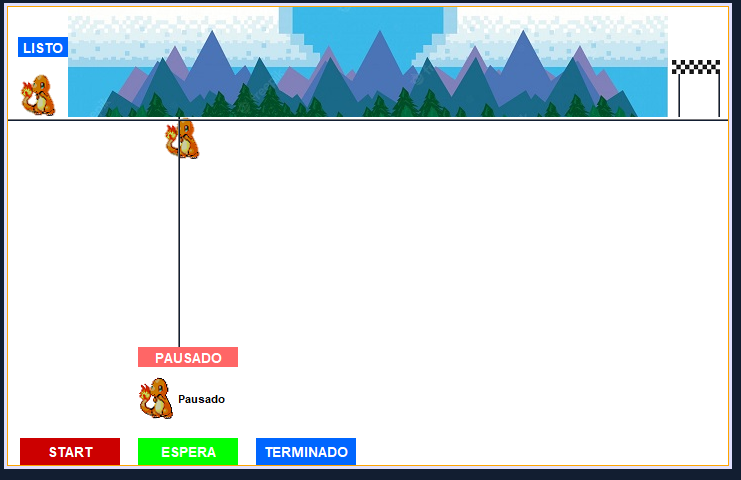

# Animación con Threads en Java NetBeans

## Introducción

Este proyecto es una aplicación de animación creada en Java utilizando el entorno de desarrollo integrado (IDE) NetBeans. La animación se logra mediante el uso de threads, que permiten ejecutar múltiples tareas concurrentemente y crear una experiencia de usuario más fluida.

## Funcionalidades

La aplicación cuenta con las siguientes funcionalidades:

Creación de una animación que muestra una figura geométrica (en este caso, un cuadrado) que se mueve en la pantalla.
Uso de threads para controlar la animación, lo que permite una mayor eficiencia y respuesta en la aplicación.
Posibilidad de pausar y reanudar la animación en cualquier momento.

## Estructura del proyecto

El proyecto se organiza de la siguiente manera:

src/main/java: Contiene los archivos de código fuente de la aplicación, incluyendo la clase principal AnimationThread y las clases auxiliares necesarias.
src/main/resources: Contiene los recursos adicionales necesarios para la aplicación, como imágenes o archivos de configuración.
build: Contiene los archivos compilados y empaquetados de la aplicación.
Clase principal: AnimationThread

La clase AnimationThread es la responsable de crear y controlar la animación. Esta clase extiende de Thread y sobreescribe el método run() para ejecutar la lógica de la animación.

## Uso de threads

La aplicación utiliza threads para controlar la animación de la siguiente manera:

Se crea un objeto AnimationThread y se inicia mediante el método start().
El método run() de la clase AnimationThread se encarga de ejecutar la lógica de la animación, que incluye la actualización de la posición de la figura geométrica y la pausa entre cada frame.
La aplicación utiliza un bucle infinito para mantener la animación en ejecución hasta que se pause o se cierre la aplicación.

## Requisitos

Para ejecutar esta aplicación, se requiere:

Java Development Kit (JDK) 8 o superior
NetBeans IDE 8.2 o superior
Instrucciones de ejecución

Para ejecutar la aplicación, sigue los siguientes pasos:

Abre el proyecto en NetBeans IDE.
Haz clic en el botón "Run" o presiona F6 para compilar y ejecutar la aplicación.
La aplicación se iniciará y mostrará la animación en la pantalla.
Licencia

Este proyecto se distribuye bajo la licencia MIT. Usted es libre de utilizar, modificar y distribuir este proyecto según sus necesidades.

## Fecha de creación

19 - 10 - 2023

